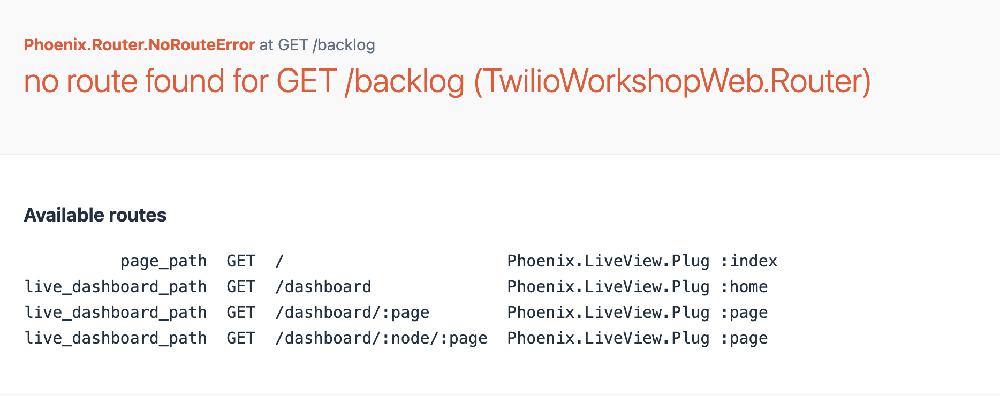
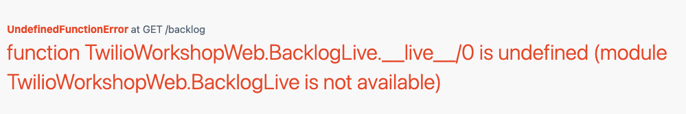
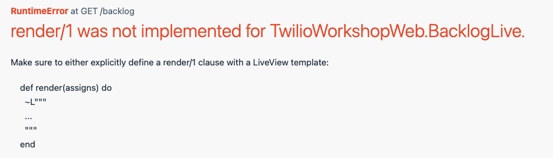
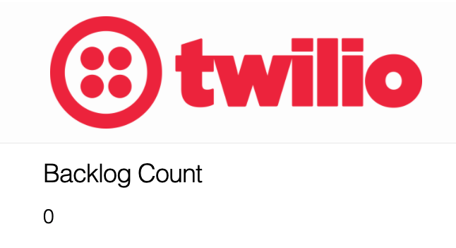
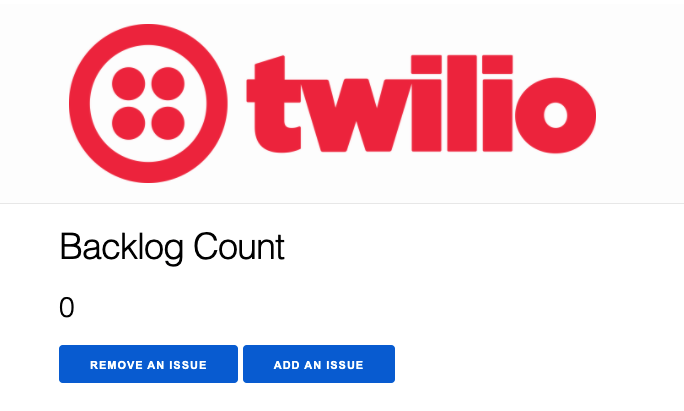
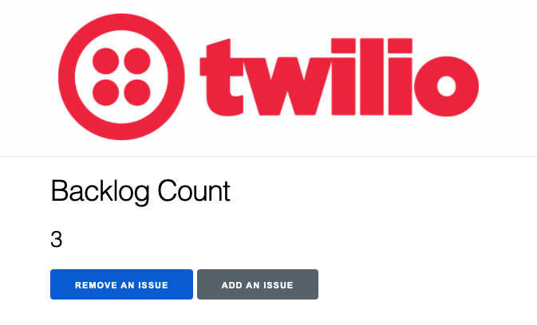

# Instructions

To start your Phoenix server:

  * Install dependencies with `mix deps.get`
  * Create and migrate your database with `mix ecto.setup`
  * Install Node.js dependencies with `npm install` inside the `assets` directory
  * Start Phoenix endpoint with `mix phx.server`

Now you can visit [`localhost:4000`](http://localhost:4000) from your browser.


## 1. Create a `/backlog` route

Visit [`localhost:4000/backlog`](http://localhost:4000/backlog) from your browser and you'll see.



Let's create a route for `/backlog` in [lib/twilio_workshop_web/router.ex](lib/twilio_workshop_web/router.ex) that takes a `BacklogLive` module.

`live "/backlog", BacklogLive`

Visit `/backlog` and you should see.



The error is telling us that the `/backlog` route tried to find a module called BacklogLive. 
Let's create that now.

## 2. Create the BackLogLive LiveView module
Create a `BacklogLive` module in [lib/twilio_workshop_web/live/backlog_live.ex](lib/twilio_workshop_web/live/backlog_live.ex).

```
defmodule TwilioWorkshopWeb.BacklogLive do
  use TwilioWorkshopWeb, :live_view

end
```

Visit `/backlog` you will see the follwoing error:



Our app is trying to render a view with the `render` callback which is not defined. Before we define `render`, we have to create our `mount` callback.


## 3. Create a mount callback
Inside our `TwilioWorkshopWeb` module in [lib/twilio_workshop_web/live/backlog_live.ex](lib/twilio_workshop_web/live/backlog_live.ex) let's create the `mount` callback to set and handle the state of the app.

```
def mount(_params, _session, socket) do

  socket = assign(socket, :count, 0)
  {:ok, socket}

end
```

Great! Now we have a mount function that manages the state of our app. We can use this to render data in our view. Let's do that now.

## 4. Create a render function


Define a `render` function.

```
def render(assigns) do
  ~L"""
    <h1>Backlog Count</h1>
    <h2><%= @count %></h2>
  """
end
```

Now you should see:




## 5. Add some buttons

Now we are going to create a way to add and remove an issue from our backlog.

First we have to add our buttons.

```
def render(assigns) do

  ~L"""
    <h1>Backlog Count</h1>
    <h2><%= @count %></h2>

    <button phx-click="remove">Remove An Issue</button>

    <button phx-click="add">Add An Issue</button>

  """
end
```

Now you should see:




## 6. Let's handle the click events from our buttons

```
def handle_event("remove", _, socket) do
  socket = update(socket, :count, &(&1 - 1))
  {:noreply, socket}
end


def handle_event("add", _, socket) do
  socket = update(socket, :count, &(&1 + 1))
  {:noreply, socket}
end
```

You should now be able to add and remove issues.



### Nice work! 